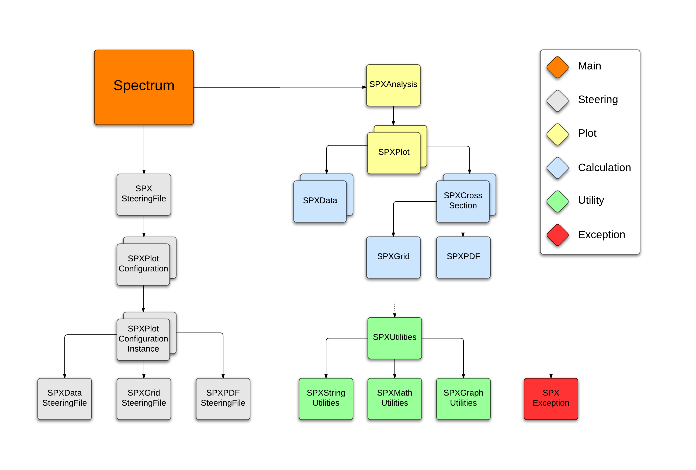

## NOTE
This version of Spectrum is a **severely** slimmed-down version, as compared with the previous [MyAnalysis](http://www.github.com/gibsjose/MyAnalysis) software. This is due to upgrades being made on the front-end of the software, as well as a re-design of the program structure. Spectrum will grow as more parts of MyAnalysis are re-designed, cleaned up, and ported over.
 
## Authors
@gibsjose @csembree Dr. Tancredi Carli

## Description
Spectrum plots cross-sections, theory results, and experimental data for proton-proton collisions. It is a collaboration between Dr. Tancredi Carli (CERN) and a few research assistants. Spectrum works with multiple grids, as well as data from multiple experiments, including CMS, ATLAS, and HERA.

## UML


## Supported Data Formats
Spectrum currently supports the following data formats:
* Spectrum T1S
* Spectrum T1A
* Spectrum T2S
* Spectrum T2A
* HERAFitter

## Installation 
Installation instructions coming soon...

## How to Run a Spectrum Plot
Running a Spectrum plot is simple; just edit your Steering file according to your plot specifications, and run Spectrum on it:

```bash
./Spectrum steering_file.txt
```

## Steering Files
An example Steering File:

```
;==============================================================
;
; Description:		
;	Example Steering File
;
; Authors:
;	Jon Doe
;	Jean Pierre Larousse
;	...
;
; Date:
;	17.09.2014
;
; Other:
;	Other information...
;
;==============================================================

;--------------------------------------------------------------
; NOTE: 
;
; Make sure you COMMENT OUT (;) ALL UNUSED LINES:
;
;	"  some_thing = "  <--- BAD
;	"; some_thing = "  <--- OKAY
;
; If you forget to do this, some trailing comments could
; be included in the option's value
;--------------------------------------------------------------

;==============================================================
; General Options
;==============================================================
[GEN]
debug = true													;[Optional] Turn on/off debug statements - [default = false]
pdf_directory = PDF 											;[Optional] If specified, will prepend this directory before
																;			all PDF steering file paths below
data_directory = Data/datanew									;[Optional] If specified, will prepend this directory before
																;			all data steering file paths below
grid_directory = Grids/top/mcfm									;[Optional] If specified, will prepend this directory before
																;			all grid steering file paths below

;==============================================================
; Graphing Options
;==============================================================
[GRAPH]
; plot_band = 													;[Optional] Plot error bands on top of data points - [default = false]
; plot_error_ticks = 											;[Optional] Use small 'ticks' at end of error  bars - [default = false]
plot_marker = true												;[Optional] Plot a marker on data points - [default = false]
plot_staggered = true											;[Optional] Stagger points horizontally to improve readability - [default = false]
label_sqrt_s = true												;[Optional] Specify to show the Sqrt(s) on the legend - [default = false]
x_legend = 0.9													;[Optional] X(Right)-Position of Legend, based on top right side
y_legend = 0.9													;[Optional]	Y(Top)-Position of legend, based on top right side
; ratio_title = 												;[Optional] Force Ratio Section Y-Axis Label to a certain value
ratio_style = convolute/data									;[REQUIRED] What to plot in the ratio section: Format: [numerator list]/[denominator]	@TODO Why is it 'required' if it has a default? Same for overlay_style. Why isn't display_style required (has no default)?
																;			Where [numerator list] can be one or more of:
																;			data, reference, or convolute
																;			And [denominator] can be ONLY ONE of:
																;			data, reference, or convolution [default = reference/data]
overlay_style = convolute, data									;[REQUIRED]	What to plot in the overlay section: Must be at least ONE of:
																;			data, reference, or convolute. [default = data, reference]
display_style =	overlay, ratio									;[Optional] What to display: can be either overlay, ratio, or both
; y_overlay_min = 												;[Optional] Force Y-Axis minimum for overlay section
; y_overlay_max = 												;[Optional] Force Y-Axis maximum for overlay section
; y_ratio_min =													;[Optional] Force Y-Axis minimum for ratio section
; y_ratio_max = 												;[Optional] Force Y-Axis maximum for ratio section

;==============================================================
; PDF Options
;==============================================================
[PDF]

pdf_steering_files = CT10.txt, HERAPDF15NLO.txt					;[REQUIRED] Required ONLY if 'convolute' is plotted. Lists all
																;			PDF Steering Files to be plotted with data.

;--------------------------------------------------------------
; NOTE:
;	
; The following options will OVERRIDE the corresponding
; options in ALL the chosen PDF Steering Files above
;--------------------------------------------------------------

pdf_fill_style = 3005											;[Optional] PDF fill style override
pdf_fill_color = 600											;[Optional] PDF fill color override
pdf_marker_style = 20											;[Optional] PDF marker style override
pdf_band_type = use_alpha_s										;[Optional] PDF band type override: use_alpha_s OR use_error_band
pdf_error_type = pdf_band										;[Optional] PDF error type override: alpha_s OR pdf_band
pdf_error_size = one_sigma										;[Optional]	PDF error size override: one_sigma OR 90_percent

;--------------------------------------------------------------
; NOTE:
;
; Below is where you define the options for each frame.
; To define a new frame, create a section with the format:
;		[FRAME_n]	where n starts at 0
;
; If a frame has more than one data file, it MUST also have a
; corresponding grid file, marker style, and marker color
;
; To give a frame more than one data file, etc., just use a comma
; separated list:
;
;		data_steering_files = file1.txt, file2.txt
;		...
;		marker_style = 20, 21
;		...
;
; Each frame is plotted on it's own ROOT canvas
;--------------------------------------------------------------
								
;==============================================================
; Frame 0 Options
;==============================================================
[FRAME_0]
																
data_steering_files = atlas2012_5fb_top_mtt_ljet.txt			;[REQUIRED] List of all data steering files

												
grid_steering_files = grid--TTbar_mttatlas.txt					;[REQUIRED] List of all grid steering files
marker_style = 20												;[REQUIRED] Marker style list
marker_color = 1												;[REQUIRED] Marker color list
; ref_line_style =												;[Optional] Reference line style list
; ref_line_color = 												;[Optional] Reference line color list
desc = atlas_mtt_5fb											;[Optional] Description of plot 

;==============================================================
; Frame 1 Options
;==============================================================
[FRAME_1]
data_steering_files = atlas2012_5fb_top_ptt_ljet.txt, some_other_data_file.txt
grid_steering_files = grid--TTbar_ptatlas.txt, some_other_grid_file.txt
marker_style = 20, 21
marker_color = 1, 2
; ref_line_style =
; ref_line_color = 
desc = atlas_ptt_5fb

;==============================================================
; Frame 2 Options
;==============================================================
[FRAME_2]
data_steering_files = atlas2012_5fb_top_pttt_ljet.txt
grid_steering_files = grid--TTbar_ptttatlas5fb.txt
marker_style = 20
marker_color = 1
; ref_line_style =
; ref_line_color = 
desc = atlas_mtt_5fb

```

### Top-Level Steering Files

### PDF Steering Files

### Data Steering Files
#### Data Formats

### Grid Steering Files
